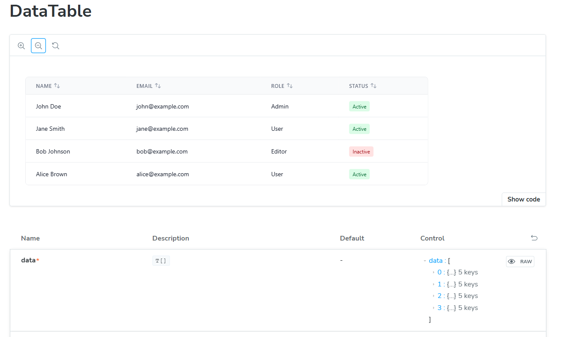
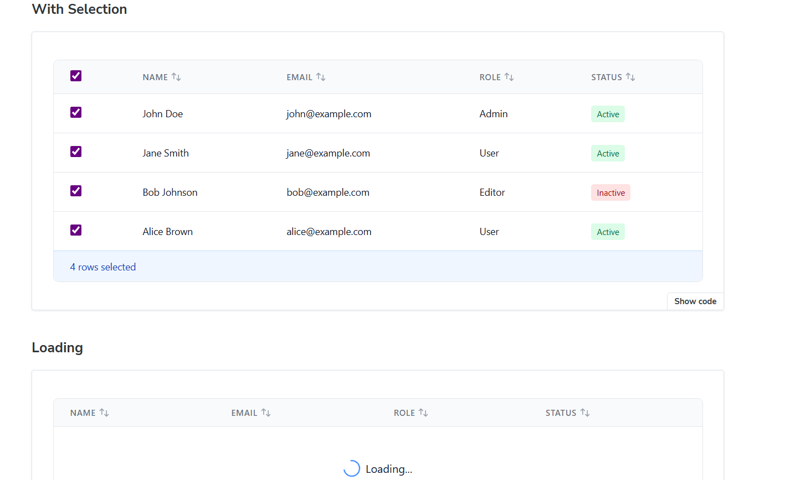
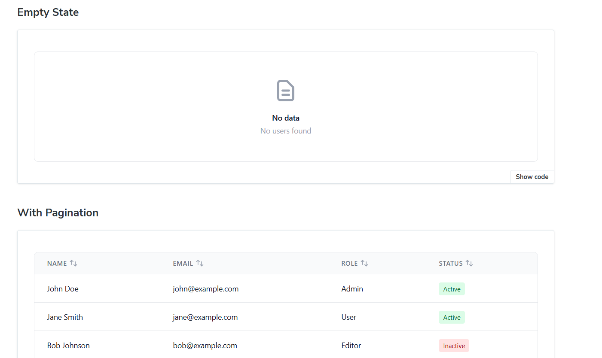
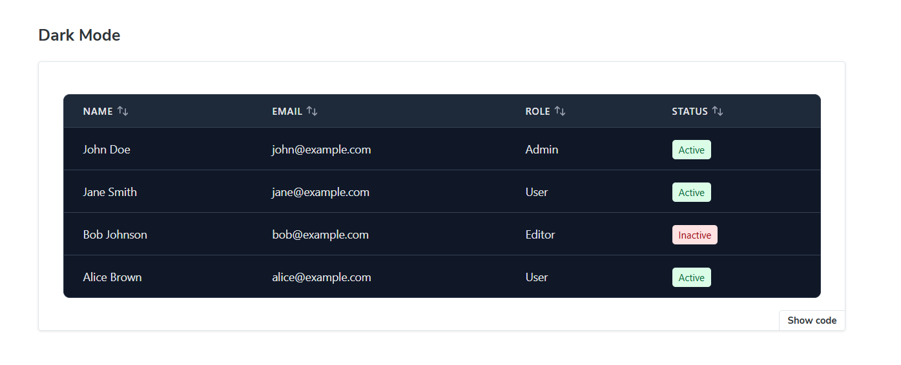
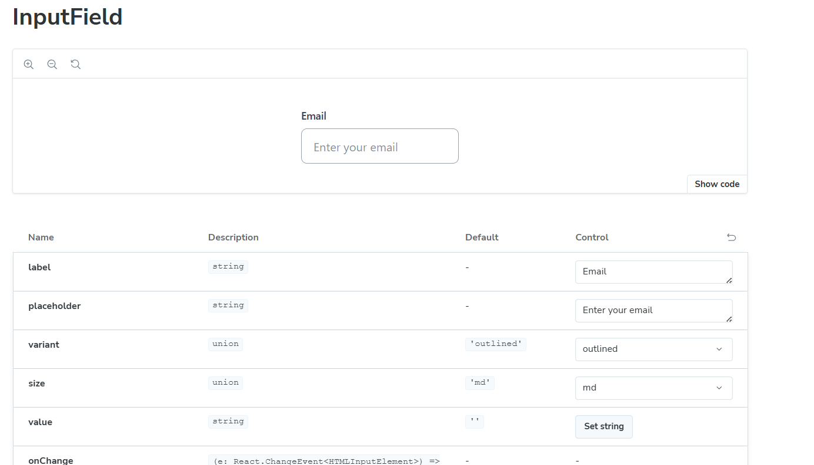
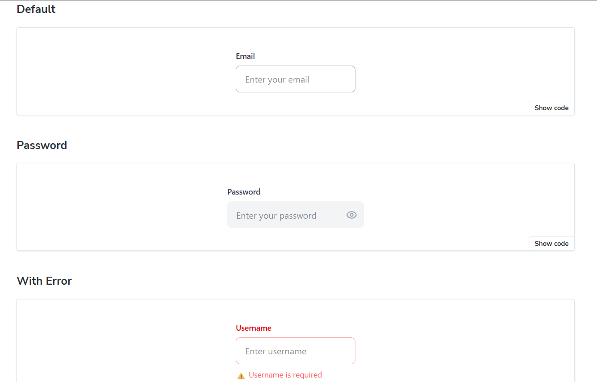
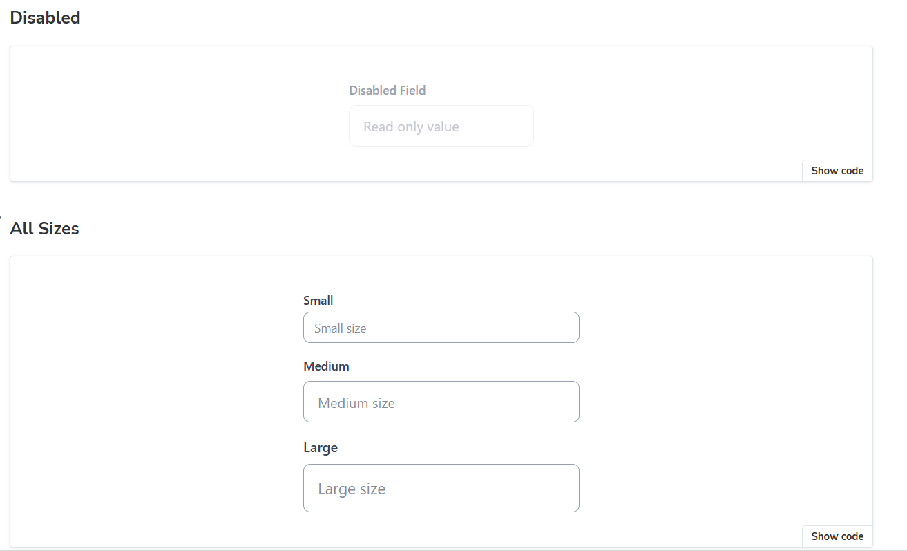
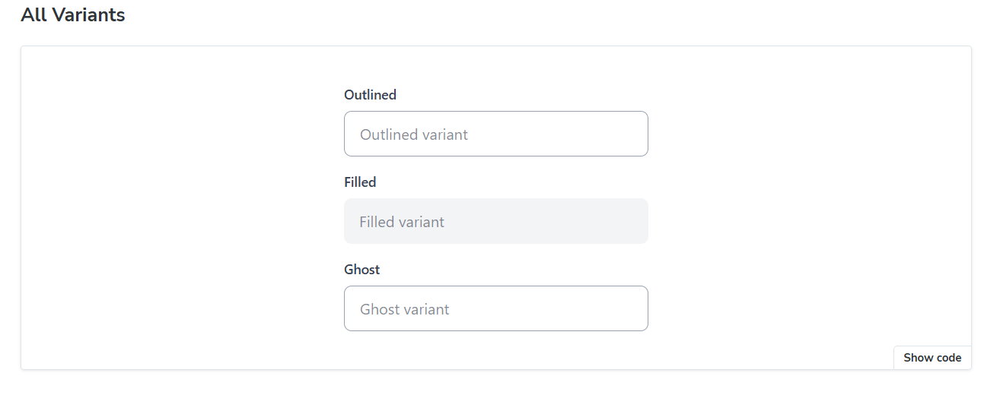

📌 Frontend Assignment – React Components

This repository contains my solution for the Frontend Components Assignment, where I built reusable and accessible UI components using React + TypeScript + TailwindCSS + Storybook.

📂 Project Structure
frontend-assignment/
├── src/
│   ├── components/         # Reusable UI components
│   │   ├── InputField.tsx  # Input component with variants, sizes & states
│   │   ├── DataTable.tsx   # Table component with sorting, selection, pagination
│   ├── stories/            # Storybook stories for each component
│   ├── App.tsx             # Demo usage of components
│   └── index.tsx           # Entry point
├── .storybook/             # Storybook configuration
├── package.json
├── tailwind.config.js
├── tsconfig.json
└── README.md

⚡ Features Implemented
🔹 InputField Component

Variants: outlined, filled, ghost

Sizes: sm, md, lg

States: normal, error, disabled, loading

Support for password visibility toggle & clear button

Light & dark theme support

🔹 DataTable Component

Configurable columns & data

Sorting by column

Row selection with callback

Pagination support

Custom cell rendering (e.g., status badge)

🛠️ Installation & Setup

Clone the repo and install dependencies:

git clone <your-repo-url>
cd frontend-assignment
npm install

Run the development server:

npm run dev

Run Storybook:

npm run storybook

Build for production:

npm run build

🌍 Live Preview

GitHub Repository: Your Repo Link

Storybook Deployment: View Storybook on Vercel/Chromatic

## 📸 Screenshots

## 📸 Screenshots

  
  
  
  
  
  
  
  

	
	
🔹 DataTable with Sorting & Selection

(Add your own screenshots or GIFs here)

📖 Approach

Component-driven development: Each UI element was built as a reusable, configurable component.

Storybook first: I documented and tested different states (variants, sizes, errors, etc.) inside Storybook.

TypeScript for safety: Used strict typing for props (e.g., variant, size, theme).

TailwindCSS for styling: Ensured clean, responsive, and theme-aware UI.

Deployment: Published Storybook using Vercel/Chromatic for easy preview.

🚀 Tech Stack

React + TypeScript

Tailwind CSS

Storybook

Vercel / Chromatic (for deployment)

✅ This completes the requirements of the assignment:

GitHub repo with clear structure + README ✔️

Storybook preview link ✔️

Screenshots/GIFs for components ✔️

# React Components Assignment

## 🚀 Description of My Approach

For this assignment, I focused on building **reusable and customizable React components** with TypeScript and Tailwind CSS. My main goal was to ensure that the components are flexible, accessible, and easy to extend.  

### 🔹 InputField Component
- Implemented an **InputField** component supporting:
  - Variants (`outlined`, `filled`, `ghost`)
  - Sizes (`sm`, `md`, `lg`)
  - States (default, disabled, error, loading)
  - Light and Dark theme support
- Added interactive features:
  - Password visibility toggle
  - Clear input button
  - Error messages and helper text
- Designed the component to be fully **controlled** with `value` and `onChange` props.

### 🔹 DataTable Component
- Built a **DataTable** component with the following features:
  - Column configuration with custom renderers
  - Sorting support for each column
  - Row selection (single/multiple)
  - Pagination with customizable page size
- Used a **generic type** (`<T>`) so the table can work with any data model, not just `User`.

### 🔹 Theming & Styling
- Used **Tailwind CSS** for styling.
- Supported **light and dark themes** using utility classes.
- Ensured consistent spacing, typography, and colors across components.

### 🔹 Development Approach
1. Started by breaking down the requirements into two main components (`InputField` and `DataTable`).
2. Designed **reusable prop interfaces** for flexibility.
3. Incrementally added features (variants, states, sorting, selection).
4. Tested components with sample data to ensure correctness.
5. Focused on **clean, readable, and modular code**.

---

## 📸 Screenshots

  
  
  
  
  
  
  
  

